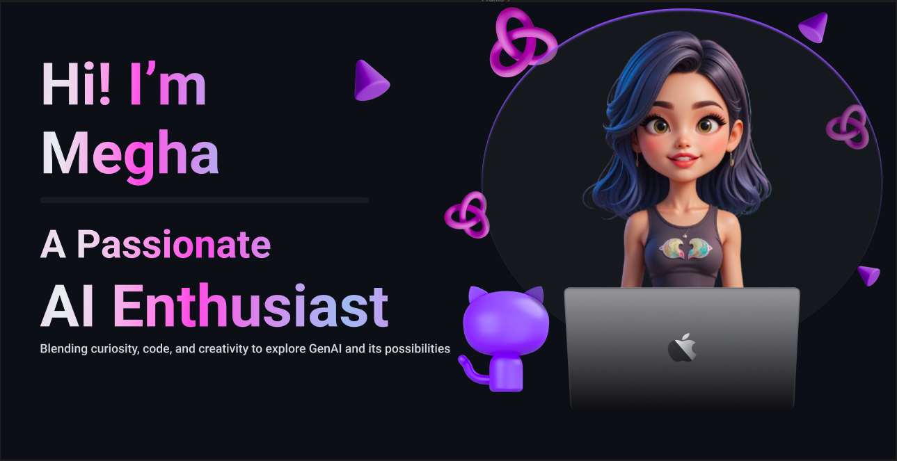

<!---
- 👋 Hi, I’m @GitMeP
- 👀 I’m interested in Artificial Intelligence
- 🌱 I’m currently learning Artificial Intelligence which includes Machine Learning, Deep Learning and NLP
- 😀 I try to learn new things such that i can gain some Knowledge
--->

<!---
GitMeP/GitMeP is a ✨ special ✨ repository because its `README.md` (this file) appears on your GitHub profile.
You can click the Preview link to take a look at your changes.
--->

<!-- Header Banner -->

  

<!-- 👋 About Me -->
## 👋 Hi, I'm Megha Pandey  
I'm a **Senior Software Engineer** passionate about Artificial Intelligence.  
🔭 I’m currently working on GenAI and NLP-related projects.  
🌱 I’m learning RAG.  

---

<!-- 🚀 Featured Projects -->
## 🚀 Featured Projects
- **[Project Name](https://github.com/you/project)** – One‑line summary of its purpose.
- **[Project Name 2](https://github.com/you/project2)** – Another key highlight.

---

<!-- 💻 Skills -->
## 💻 Skills & Tools  

---

<!-- 📊 GitHub Stats -->
## 📊 My GitHub Stats

  

---

<!-- 👀 Visitor Count -->

